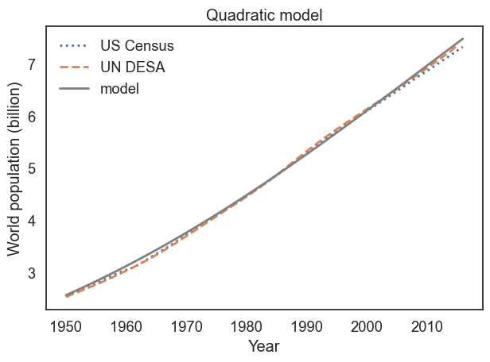
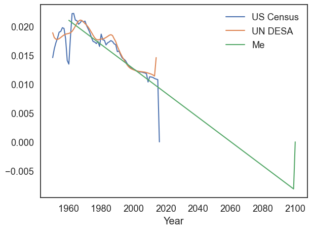

# DATA604
This course was a focus on simulation and modeling techniques for real world scenarios. This course utilized modsim and touched on simpy.


## Population Growth
A simple quadratic based system using birth and death rates.

```
##Pre 80 Generation
t_0 = get_first_label(census)
t_80end = 1980
elapsed_time_pre80 = t_80end - t_0

p_0 = get_first_value(census)
p_80end = census.loc[1980]
total_growth_pre80 = p_80end - p_0

annual_growth_pre80 = total_growth_pre80 / elapsed_time_pre80

#Post 80 Generation
t_1981 = 1981
t_end = get_last_label(census)
elapsed_time_post80 = t_end - t_1981

p_1981 = census.loc[1981]
p_end = get_last_value(census)
total_growth_post80 = p_end - p_1981

annual_growth_post80 = total_growth_post80 / elapsed_time_post80


system = System(t_0=t_0, 
                t_end=t_end,
                p_0=p_0,
                alpha1= annual_growth_pre80 ,
                alpha2= annual_growth_post80
               )


def update_func3(pop, t, system):
    """Compute the population next year.
    
    pop: current population
    t: current year
    system: system object containing parameters of the model
    
    returns: population next year
    """
    if t < 1981:
        net_growth = system.alpha1
    else:
        net_growth = system.alpha2
        
    return pop + net_growth


def run_simulation(system, update_func):
    """Simulate the system using any update function.
    
    system: System object
    update_func: function that computes the population next year
    
    returns: TimeSeries
    """
    results = TimeSeries()
    results[system.t_0] = system.p_0
    
    for t in linrange(system.t_0, system.t_end):
        
        results[t+1] = update_func3(results[t], t, system)
        
    return results

# Solution goes here
pd.set_option('display.max_rows', None)
pd.set_option('display.max_columns', None)
results = run_simulation(system, update_func3)
plot_results(census, un, results, 'Proportional model, combined birth and death')
display(system)
display(results)
```




### Projections of Population

Here we add a alpha_func, that updates the alpha parameter based on the current net growth rate to become more accurate in projections, rather than using an averaged value over decades.

```
#Create a System object that includes alpha_func as a system variable.
t_0 = 1960
p_0 = census[t_0]
ngr = alpha_func(1960)
system = System(net_growth_rate=alpha_func, 
                t_0=t_0,
                t_end = t_end,
                p_0=p_0,
                alpha = alpha_0
               )

# Run a simulation from 1960 to 2100 with your update function, and plot the results.
def run_simulation(system, update_func):
    """Simulate the system using any update function.
    
    system: System object
    update_func: function that computes the population next year
    
    returns: TimeSeries
    """
    results = TimeSeries()
    results[system.t_0] = system.p_0
    
    for t in linrange(system.t_0, system.t_end):
        results[t+1] = update_func(results[t],t, system)
        
    return results


results = run_simulation(system, update_alpha)


# Plot results
def plot_results(census, un, timeseries, title):
    """Plot the estimates and the model.
    
    census: TimeSeries of population estimates
    un: TimeSeries of population estimates
    timeseries: TimeSeries of simulation results
    title: string
    """
    plot(census, ':', label='US Census')
    plot(un, '--', label='UN DESA')
    plot(timeseries, color='gray', label='model')
    
    decorate(xlabel='Year', 
             ylabel='World population (billion)',
             title=title)
    
plot_results(census,un, results, "Comparison")
```




## Infection Rates Among Students
 This simulation introduces a model based on infection rates of college students using an SIR model. It also allows us to simulate the impacts of immunization.
 
 S - # of Susceptible Students = 89
 I - # of Infected Students = 1
 R - # of Recovered Students = 0

tc - Contact Rate = 3 days
tr - Recovery Rate = 4 days


```
def make_system(beta, gamma):
    """Make a system object for the SIR model.
    
    beta: contact rate in days
    gamma: recovery rate in days
    
    returns: System object
    """
    init = State(S=89, I=1, R=0)
    init /= sum(init)

    t0 = 0
    t_end = 7 * 14 #(days in a standard semester)

    return System(init=init, t0=t0, t_end=t_end,
                  beta=beta, gamma=gamma)

# Initializing parameters

tc = 3      # time between contacts in days 
tr = 4      # recovery time in days

beta = 1 / tc      # contact rate in per day
gamma = 1 / tr     # recovery rate in per day

system = make_system(beta, gamma)

# Establish the Update Function

def update_func(state, t, system):
    """Update the SIR model.
    
    state: State with variables S, I, R
    t: time step
    system: System with beta and gamma
    
    returns: State object
    """
    s, i, r = state

    infected = system.beta * i * s    
    recovered = system.gamma * i
    
    s -= infected
    i += infected - recovered
    r += recovered
    
    return State(S=s, I=i, R=r)

# Run Simulation Function

def run_simulation(system, update_func):
    """Runs a simulation of the system.
    
    Add three Series objects to the System: S, I, R
    
    system: System object
    update_func: function that updates state
    """
    S = TimeSeries()
    I = TimeSeries()
    R = TimeSeries()

    state = system.init
    t0 = system.t0
    S[t0], I[t0], R[t0] = state
    
    for t in linrange(system.t0, system.t_end):
        state = update_func(state, t, system)
        S[t+1], I[t+1], R[t+1] = state
    
    return S, I, R

# Running Simulation
S, I, R = run_simulation(system, update_func)

# Plotting Results

def plot_results(S, I, R):
    """Plot the results of a SIR model.
    
    S: TimeSeries
    I: TimeSeries
    R: TimeSeries
    """
    plot(S, '--', label='Susceptible')
    plot(I, '-', label='Infected')
    plot(R, ':', label='Recovered')
    decorate(xlabel='Time (days)',
             ylabel='Fraction of population')
plot_results(S, I, R)


