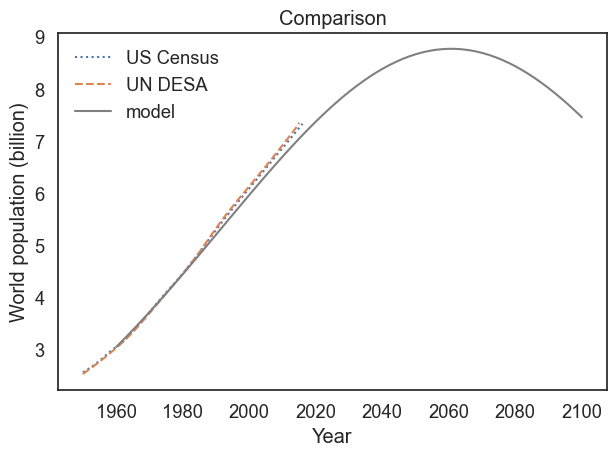

# DATA604
This course was a focus on simulation and modeling techniques for real world scenarios. This course utilized modsim and touched on simpy.


## Population Growth
A simple quadratic based system using birth and death rates.

```
##Pre 80 Generation
t_0 = get_first_label(census)
t_80end = 1980
elapsed_time_pre80 = t_80end - t_0

p_0 = get_first_value(census)
p_80end = census.loc[1980]
total_growth_pre80 = p_80end - p_0

annual_growth_pre80 = total_growth_pre80 / elapsed_time_pre80

#Post 80 Generation
t_1981 = 1981
t_end = get_last_label(census)
elapsed_time_post80 = t_end - t_1981

p_1981 = census.loc[1981]
p_end = get_last_value(census)
total_growth_post80 = p_end - p_1981

annual_growth_post80 = total_growth_post80 / elapsed_time_post80


system = System(t_0=t_0, 
                t_end=t_end,
                p_0=p_0,
                alpha1= annual_growth_pre80 ,
                alpha2= annual_growth_post80
               )


def update_func3(pop, t, system):
    """Compute the population next year.
    
    pop: current population
    t: current year
    system: system object containing parameters of the model
    
    returns: population next year
    """
    if t < 1981:
        net_growth = system.alpha1
    else:
        net_growth = system.alpha2
        
    return pop + net_growth


def run_simulation(system, update_func):
    """Simulate the system using any update function.
    
    system: System object
    update_func: function that computes the population next year
    
    returns: TimeSeries
    """
    results = TimeSeries()
    results[system.t_0] = system.p_0
    
    for t in linrange(system.t_0, system.t_end):
        
        results[t+1] = update_func3(results[t], t, system)
        
    return results

# Solution goes here
pd.set_option('display.max_rows', None)
pd.set_option('display.max_columns', None)
results = run_simulation(system, update_func3)
plot_results(census, un, results, 'Proportional model, combined birth and death')
display(system)
display(results)
```


### Projections of Population

Here we add a alpha_func, that updates the alpha parameter based on the current net growth rate to become more accurate in projections, rather than using an averaged value over decades.

```
#Create a System object that includes alpha_func as a system variable.
t_0 = 1960
p_0 = census[t_0]
ngr = alpha_func(1960)
system = System(net_growth_rate=alpha_func, 
                t_0=t_0,
                t_end = t_end,
                p_0=p_0,
                alpha = alpha_0
               )

# Run a simulation from 1960 to 2100 with your update function, and plot the results.
def run_simulation(system, update_func):
    """Simulate the system using any update function.
    
    system: System object
    update_func: function that computes the population next year
    
    returns: TimeSeries
    """
    results = TimeSeries()
    results[system.t_0] = system.p_0
    
    for t in linrange(system.t_0, system.t_end):
        results[t+1] = update_func(results[t],t, system)
        
    return results


results = run_simulation(system, update_alpha)


# Plot results
def plot_results(census, un, timeseries, title):
    """Plot the estimates and the model.
    
    census: TimeSeries of population estimates
    un: TimeSeries of population estimates
    timeseries: TimeSeries of simulation results
    title: string
    """
    plot(census, ':', label='US Census')
    plot(un, '--', label='UN DESA')
    plot(timeseries, color='gray', label='model')
    
    decorate(xlabel='Year', 
             ylabel='World population (billion)',
             title=title)
    
plot_results(census,un, results, "Comparison")
```


